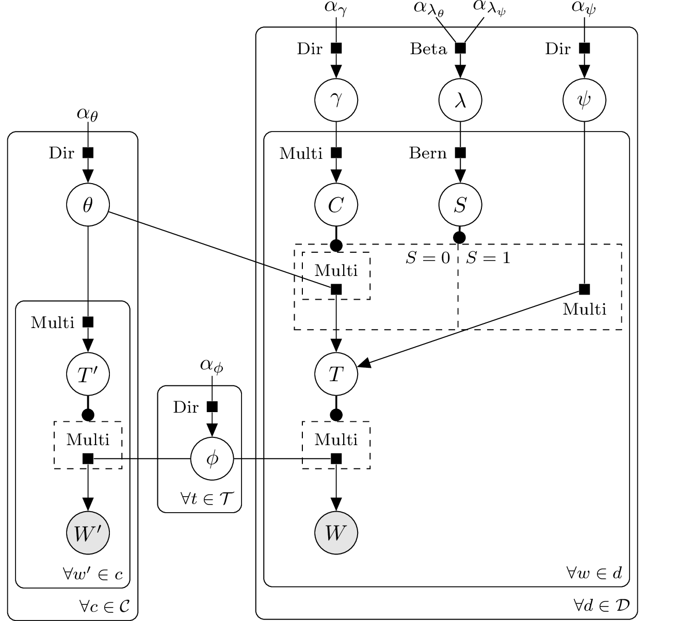

BayesNet
========

TikZ library for drawing Bayesian networks and (directed) factor
graphs in LaTeX.

Contents
--------

Provides the following node styles:

* :code:`latent`

* :code:`obs`

* :code:`const`

* :code:`factor`

Provides the following commands:

* :code:`\factor`

* :code:`\plate`

* :code:`\gate`

* :code:`\vertgate`

* :code:`\edge`

* :code:`\factoredge`

Usage
-----

Install the package by copying tikzlibrarybayesnet.code.tex to your
LaTeX system or copy the file into projects that are using it.  To use
the library in your LaTeX file

.. code-block::

   \usepackage{tikz}
   \usetikzlibrary{bayesnet}

Compile the LaTeX example:

.. code-block::

   pdflatex example.tex

and see the resulting PDF file example.pdf.

Example
-------

   Citation influence model.

Related projects
----------------

This library is derived from a technical report "Directed Factor Graph
Notation for Generative Models" and the accompanying TikZ macros by
Laura Dietz 2010 (http://people.cs.umass.edu/~dietz/).

GraphViz (http://www.graphviz.org/) is a more general open source
graph visualization software.  It uses DOT file format to describe the
structure of the graph.  The DOT file can be converted to LaTeX using
:code:`dot2tex` (http://www.fauskes.net/code/dot2tex/).

UAI (http://graphmod.ics.uci.edu/uai08/FileFormat) is a simple text
file format to describe Markov networks. The UAI file format can be
converted to DOT file format using :code:`uai2dot`
(https://github.com/drewfrank/uai2dot).

License
-------

| Copyright (C) 2010-2011 Laura Dietz
| Copyright (C) 2012 Jaakko Luttinen jaakko.luttinen@aalto.fi

This work may be distributed and/or modified under the conditions of
the LaTeX Project Public License, either version 1.3 of this license
or (at your option) any later version.  The license is in the file
LICENSE and the latest version of this license is in
http://www.latex-project.org/lppl.txt and version 1.3 or later is part
of all distributions of LaTeX version 2005/12/01 or later.

This work has the LPPL maintenance status `maintained'.
 
The Current Maintainer of this work is Jaakko Luttinen.

This work consists of the files bayesnet.sty and example.tex.

